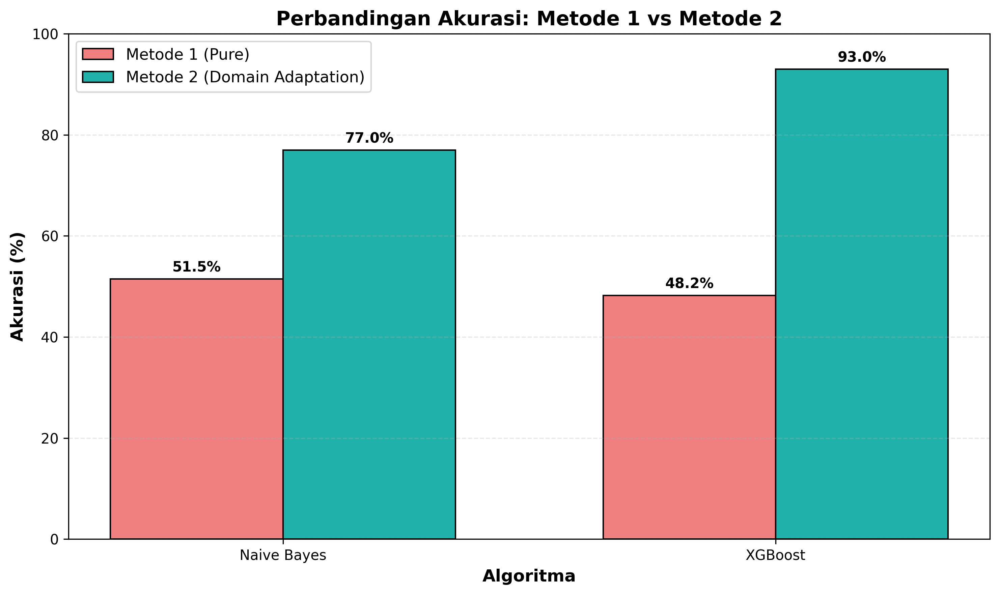

# Klasifikasi Spam Email (Skripsi)

Aplikasi Web berbasis **Machine Learning** untuk mengklasifikasikan email spam vs bukan spam, yang dibangun sebagai luaran dari penelitian skripsi. Aplikasi ini menggunakan **Flask (Python)** untuk *backend* dan antarmuka web modern menggunakan HTML/CSS/JS murni.

## 🌟 Fitur Utama

- **Mode Teks Langsung (Real-time Testing):** Prediksi langsung apakah sebuah teks email terindikasi sebagai spam atau normal, lengkap dengan **Contoh Cepat (Quick Examples)** untuk pengujian instan.
- **Mode Evaluasi Batch (CSV):** Menguji model secara massal menggunakan dataset pengujian (`.csv`) untuk mendapatkan metrik performa (Akurasi, F1-Score, Waktu Eksekusi) dalam hitungan detik.
- **Balancing Dataset Fleksibel:** Pengaturan rasio proporsi kelas data (Spam vs Non-Spam) secara bebas dari 10:90 hingga 90:10, baik untuk *Training* maupun *Test*.
- **Perbandingan Model (Naive Bayes vs XGBoost):** Membandingkan performa dua algoritma secara *real-time* lengkap dengan grafik bar interaktif dan tabel *Confusion Matrix*.
- **Riwayat Eksperimen:** Semua hasil eksperimen tersimpan secara otomatis, dan dapat dilihat, disematkan (Pin), diberi catatan khusus, maupun dihapus sekaligus (*Batch Delete*). Terdapat **visual feedback** untuk memudahkan identifikasi data terpilih.
- **Mode Gelap (Dark Mode):** Antarmuka yang sangat responsif, mendukung HP/Mobile, dan memiliki transisi Mode Terang/Gelap yang modern.

## 📸 Cuplikan Layar (Screenshots)

<!-- Contoh:  -->

### Hasil Analisis Penelitian
Berikut adalah contoh grafik hasil komparasi algoritma yang dihasilkan dari pengujian eksperimen:

*(Grafik di atas membandingkan performa model menggunakan Metode 1 vs Metode 2).*

## 🚀 Cara Menjalankan Aplikasi

Tidak perlu konfigurasi *server* yang rumit! Cukup ikuti langkah berikut untuk menjalankan di Windows:

1. Pastikan **Python** sudah terinstal di laptop Anda.
2. Unduh atau *Clone* repositori ini.
3. Buka folder utama repositori.
4. Klik ganda (*Double-Click*) pada file **`Jalankan_Aplikasi.bat`**.
5. Skrip akan secara otomatis membangun *Virtual Environment*, menginstal dependensi (`requirements.txt`), dan menyalakan *server*.
6. Buka peramban (Chrome/Edge) dan akses: **http://127.0.0.1:5000**

*(Catatan: Aplikasi ini juga bisa diakses lewat HP asalkan HP dan Laptop terhubung di jaringan WiFi / Hotspot yang sama, dengan cara mengetikkan IP lokal laptop di browser HP).*

## 📚 Dokumentasi Ekstra

Untuk membaca ringkasan utuh penelitian, *changelog*, pemecahan masalah algoritma (mengapa Akurasi Metode 2 turun), dan alur logika aplikasi, silakan buka file **`DOKUMENTASI.md`** di repositori ini. 

## 🛠 Teknologi

- **Kecerdasan Buatan (AI/ML):** Scikit-Learn (Naive Bayes), XGBoost
- **Backend:** Python 3, Flask, Pandas, Joblib
- **Frontend:** HTML5, CSS3, JavaScript, Chart.js
